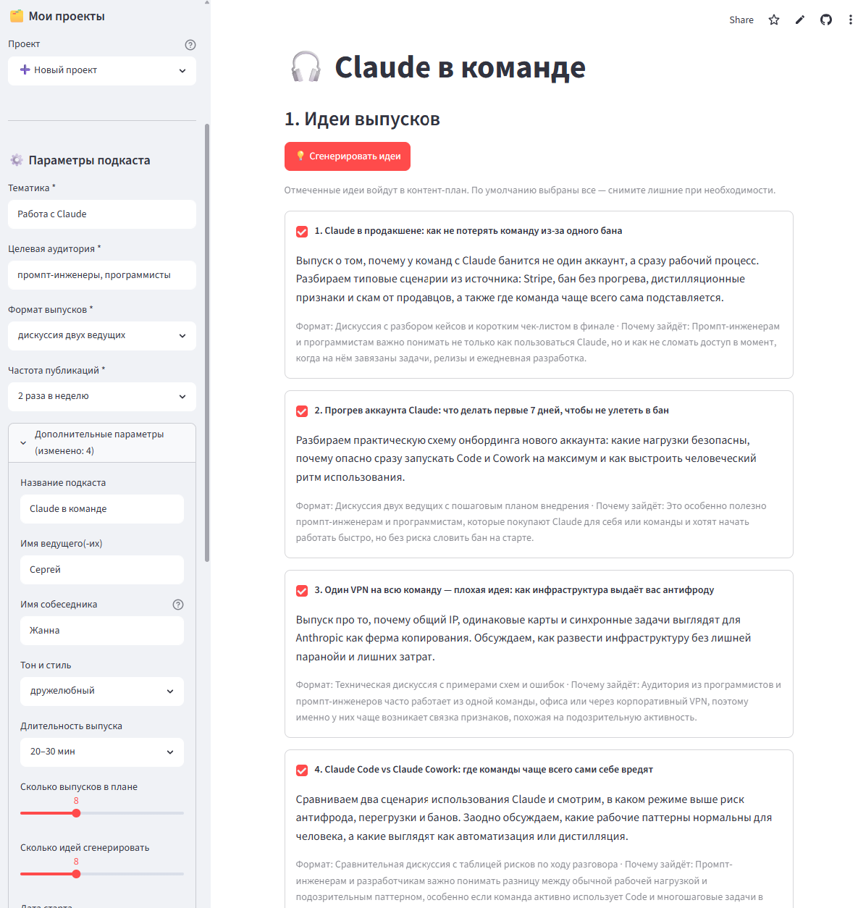
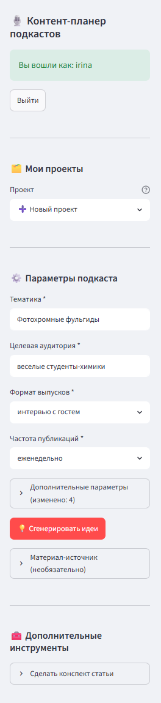
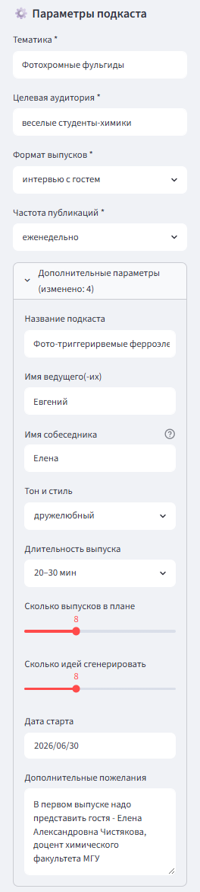
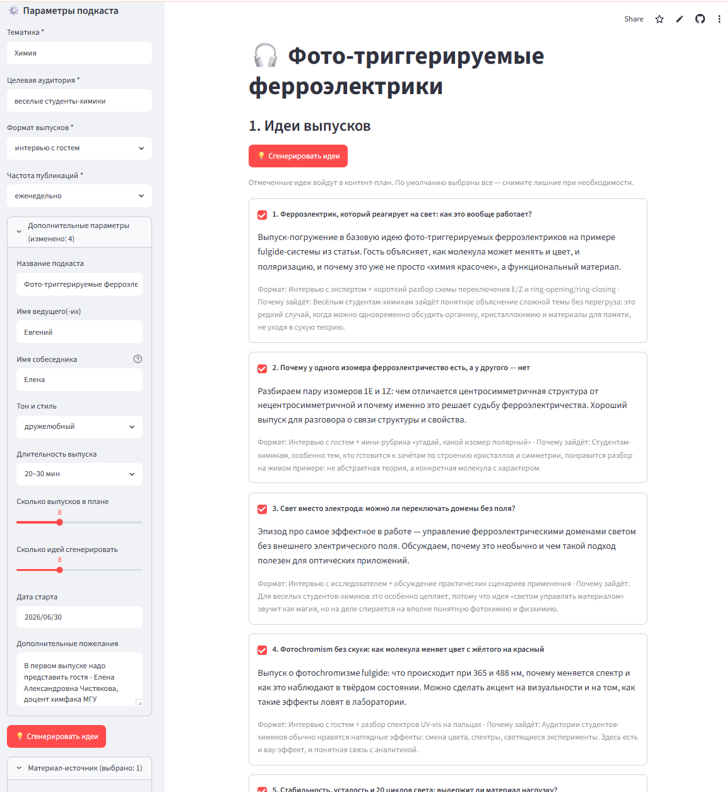
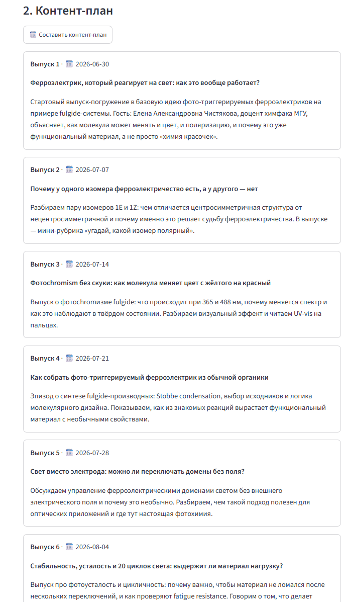
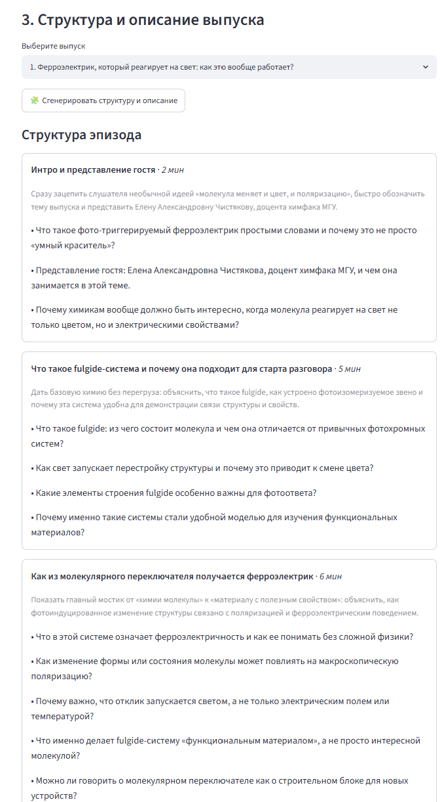
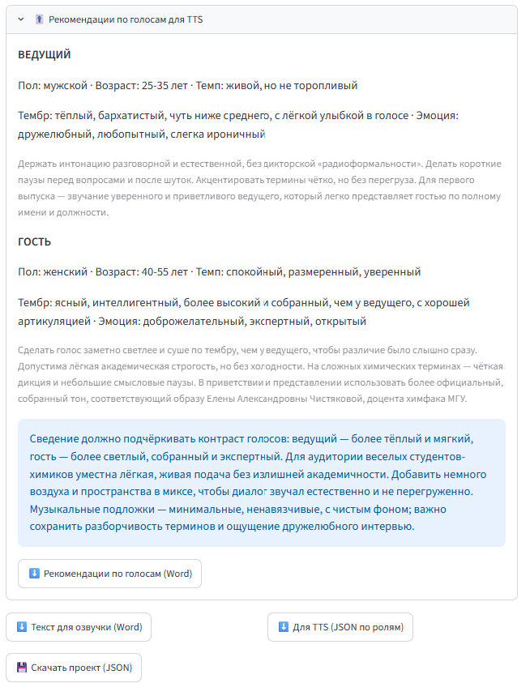
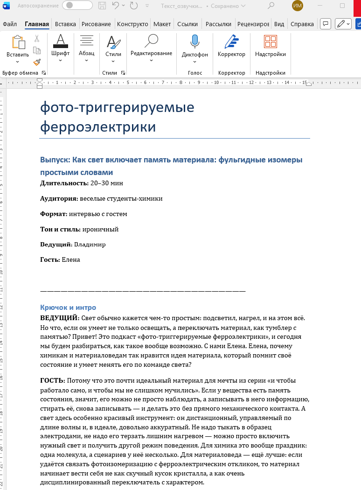
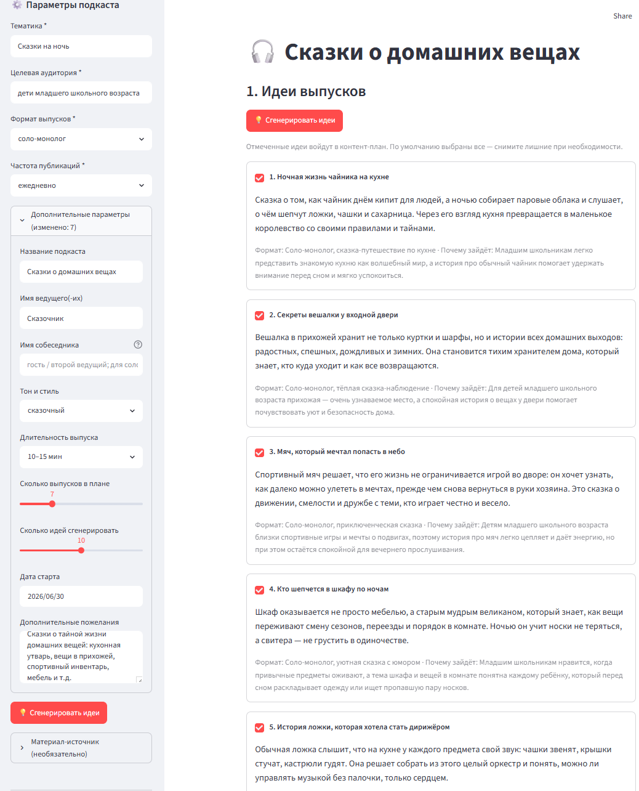

# 🎙️ Podcast Content Planner

ИИ-ассистент для планирования подкастов: от идей выпусков до готового текста
для озвучки и рекомендаций по голосам для синтеза речи (TTS).

Веб-приложение на [Streamlit](https://streamlit.io/). Пользователь задаёт
параметры подкаста, а система последовательно генерирует идеи, контент-план,
структуру эпизода, описание и финальный произносимый текст по ролям.

🇬🇧 English version: [README.md](README.md)

## Возможности

- **Аутентификация** пользователей (логин/пароль); у каждого — свои проекты
  и библиотека источников.
- **Пятишаговый конвейер генерации:** идеи выпусков → контент-план →
  структура эпизода → описание → текст для озвучки.
- **Материалы-источники:** загрузка файлов (txt, md, pdf, docx, pptx, xlsx)
  или статей по ссылке; идеи и тексты опираются на них.
- **Конспект статьи** как отдельный инструмент (популярные и научные статьи);
  результат можно подключить как источник для подкаста.
- **Форматы выпусков:** интервью с гостем, дискуссия двух ведущих,
  соло-монолог, обзор/разбор, сторителлинг, вопрос-ответ и **сказка**
  (единый рассказчик, сюжетная арка вместо блоков подкаста).
- **Тон и стиль:** дружелюбный, экспертный, ироничный, мотивирующий,
  академичный, сказочный. Сказочный стиль комбинируется с любым форматом
  (например, научная тема сказочным языком для детей). Правила детской
  безопасности включаются автоматически, если аудитория детская, и
  переопределяются в доп. пожеланиях; голос для TTS подбирается детский
  или взрослый.
- **Текст для озвучки по ролям** (ВЕДУЩИЙ / ГОСТЬ) с накопительным контекстом
  между блоками и финальной редакторской вычиткой: убирает повторные
  представления и приветствия в середине, исправляет путаницу ролей и
  благодарности «самому себе», склеивает подряд идущие реплики одного
  говорящего, сокращает дословные повторы и унифицирует обозначения
  (например, E/Z изомеров).
- **Рекомендации по голосам для TTS** (пол, возраст, тембр, темп, эмоция).
- **Умная перегенерация:** при изменении параметров система спрашивает,
  с какого шага пересобрать (только структура / план + структура / всё с идей
  и т.д.).
- **Сохранение проектов:** «Сохранить изменения» и «Сохранить как новый
  проект» (удобно делать из одного источника варианты под разные аудитории).
- **Экспорт:** текст озвучки и рекомендации по голосам в Word (.docx),
  конспект статьи в Word, проект и TTS-скрипт в JSON. В Word-файл попадает
  техническая шапка (название подкаста, длительность, аудитория, стиль, имена).
- **Контроль качества текста:** автоматическая чистка слов со смешанным
  алфавитом (кириллица + латиница) с пользовательским словарём замен
  (хранится в БД, общий для всех проектов, пополняется прямо в интерфейсе
  и применяется автоматически); диагностика нераспознанных случаев.
  Финальная вычитка также правит искаженные русские слова, ошибки
  согласования и логические нестыковки повествования.

## Технологический стек

- Python 3.10+
- Streamlit — веб-интерфейс
- OpenAI API — генерация текста (модель по умолчанию: gpt-5.4-mini)
- SQLite — постоянное хранение (podcast_planner.db)
- python-docx — экспорт в Word
- pypdf, python-docx, python-pptx, openpyxl — извлечение текста из файлов
- trafilatura — извлечение текста статей по ссылке
- python-dotenv — переменные окружения

## Структура проекта

    .
    ├── app.py                      # Веб-интерфейс (Streamlit), весь UI и оркестрация
    ├── core/
    │   ├── generator.py            # Логика многошаговой генерации
    │   └── prompts.py              # Все промпты системы
    ├── services/
    │   ├── auth_service.py         # Регистрация и вход
    │   ├── db_service.py           # SQLite: пользователи, материалы, проекты, словарь смешанных слов
    │   ├── export_service.py       # Экспорт в Word (.docx)
    │   ├── llm_service.py          # Обёртка вызова OpenAI, разбор JSON
    │   └── source_service.py       # Извлечение текста из файлов и ссылок
    ├── requirements.txt
    ├── .env                        # Переменные окружения (НЕ коммитить)
    └── README.md

## Установка и запуск

1. Клонируйте репозиторий и перейдите в каталог проекта.

2. Создайте и активируйте виртуальное окружение:

       python -m venv venv
       source venv/bin/activate        # Windows: venv\Scripts\activate

3. Установите зависимости:

       pip install -r requirements.txt

4. Создайте файл `.env` в корне проекта:

       OPENAI_API_KEY=sk-...           # обязательно
       OPENAI_MODEL=gpt-5.4-mini        # необязательно, по умолчанию gpt-5.4-mini
       DB_PATH=podcast_planner.db      # необязательно, по умолчанию podcast_planner.db

5. Запустите приложение:

       streamlit run app.py

6. Откройте адрес, который выведет Streamlit (по умолчанию http://localhost:8501).

При первом запуске создайте учётную запись на вкладке «Регистрация».

## Использование

1. **Параметры подкаста** (слева): тематика и аудитория обязательны;
   в дополнительных параметрах — название, имена участников, тон, длительность,
   число идей и выпусков, дата старта, дополнительные пожелания.
2. **Материал-источник** (необязательно): загрузите файл/ссылку или выберите
   из библиотеки; либо сделайте конспект статьи и подключите его.
3. Нажмите **«Сгенерировать идеи»**, затем по шагам: контент-план → структура →
   текст для озвучки.
4. Скачайте результат (Word / JSON) и сохраните проект.

> **Дополнительные пожелания** учитываются на всех шагах генерации. Туда можно
> писать свободные указания: как представить гостя, «это первый/не первый
> выпуск цикла», что включить или чего избегать.

## Развёртывание на сервере

- Запуск за reverse-proxy (nginx) с указанием порта Streamlit.
- Явно задайте адрес и порт:

      streamlit run app.py --server.port 8501 --server.address 0.0.0.0

- Файл `.env` и базу данных храните вне публичного доступа и в бэкапах.
  Ключ `OPENAI_API_KEY` нельзя коммитить в репозиторий.
- Файл базы данных создаётся автоматически при первом запуске.

## Безопасность

- Пароли хранятся в хешированном виде (см. `auth_service.py`).
- Внешние ключи каскадные: удаление пользователя удаляет его материалы
  и проекты.
- Правила детской безопасности применяются автоматически, когда аудитория
  определяется как детская (для любого формата, не только сказки), и
  переопределяются в доп. пожеланиях.

## Примечания и ограничения

- Генерация зависит от внешнего OpenAI API: качество и скорость определяются
  выбранной моделью; возможны редкие ошибки разбора ответа.
- Финальная редакторская вычитка снижает число дефектов, но перед записью
  текст рекомендуется проверить вручную (особенно фактические тонкости).
- Текст источника, отправляемый в модель, обрезается (~12 000 символов),
  чтобы ограничить размер промпта.

**Screenshots:**  

